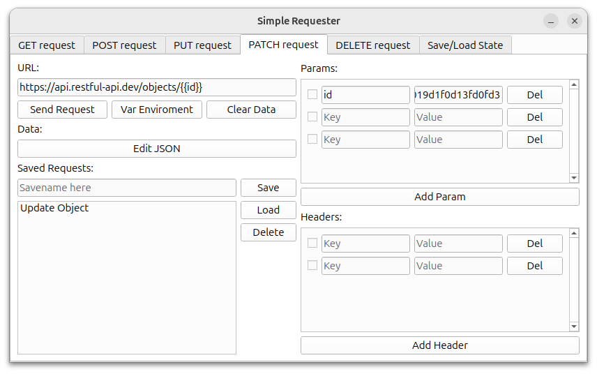
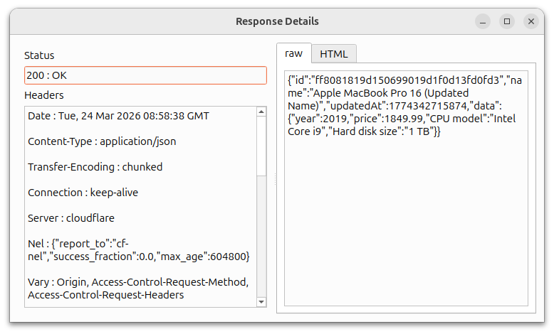

# Simple Requester

A lightweight API testing tool built with Python, PySide6, and the requests library. It provides a graphical interface for composing and sending HTTP requests, viewing responses, and saving/loading request configurations.




## Features

- **HTTP Methods**: GET, POST, PUT, PATCH, DELETE
- **Request Configuration**:
  - URL with support for environment variables (e.g. `{{base_url}}/users/{{user_id}}`)
  - Query parameters and headers as key-value pairs with on/off toggle
  - JSON payload editing for POST, PUT, PATCH, DELETE
- **Response Viewer**:
  - Status code and reason
  - Response headers
  - Raw response content
  - Formatted HTML preview
- **Environment Variables**: Define and reuse variables in URLs via a dedicated dialog
- **Save/Load**: Persist all request configurations per method to a `.srsf` file
- **Request History**: Save successful requests with custom names for each method tab

## Requirements

- Python 3.8 or higher
- [PySide6](https://pypi.org/project/PySide6/)
- [Requests](https://pypi.org/project/requests/)
- [BeautifulSoup4](https://pypi.org/project/beautifulsoup4/)

## Installation

1. Clone the repository:
   ```bash
   git clone https://github.com/your-username/simple-requester.git
   cd simple-requester
   ```

2. Create and activate a virtual environment (recommended):
   ```bash
   python -m venv venv
   source venv/bin/activate   # On Windows: venv\Scripts\activate
   ```

3. Install the dependencies:
   ```bash
   pip install -r requirements.txt
   ```
   If no `requirements.txt` exists, install manually:
   ```bash
   pip install PySide6 requests beautifulsoup4
   ```

## Usage

Run the main script:
```bash
python main.py
```

- Select the HTTP method tab (GET, POST, PUT, PATCH, DELETE).
- Enter the request URL, parameters, headers, and (for POST/PUT/PATCH) JSON data.
- Use the **Var Enviroment** button to define variables like `{{base_url}}` that will be replaced in the URL.
- Click **Send Request** to execute the request.
- The response will open in a new window with tabs for raw content and HTML preview.
- Save successful requests by entering a name and clicking **Save**; load or delete them from the list.
- Use the **Save/Load State** tab to store all tabs’ current state to a file or load a previously saved state.

## Project Structure

```
simple-requester/
├── main.py                               # Application entry point
├── mainwidgets/
│   ├── mainwidget.py                     # Main window with tabbed interface
│   └── responsewidget.py                 # Response display window
├── requestwidgets/
│   ├── getwidget.py                      # GET request tab
│   └── generalrequestwidget.py           # Base for POST/PUT/PATCH/DELETE tabs
├── managementwidgets/
│   └── saveloadwidget.py                 # Global save/load for all tabs
├── innerwidgets/
│   ├── keyvaluewidget.py                 # Key-value pair editor (headers/params)
│   ├── urlvaluewidget.py                 # Environment variable editor (list)
│   └── jsonwidget.py                     # JSON input dialog
├── datawidgets/
│   └── urlenviromentvariableswidget.py   # Environment variable manager
├── utils/
│   └── helper.py                         # Helper functions (e.g., JSON validation)
└── requirements.txt                      # Dependencies
```

## Known Limitations

- There no way to format responses like JSON for readability.
- Placeholder text in some places (e.g. help text for enirement variables)

## License

This project is open source and available under the [MIT License](LICENSE).
